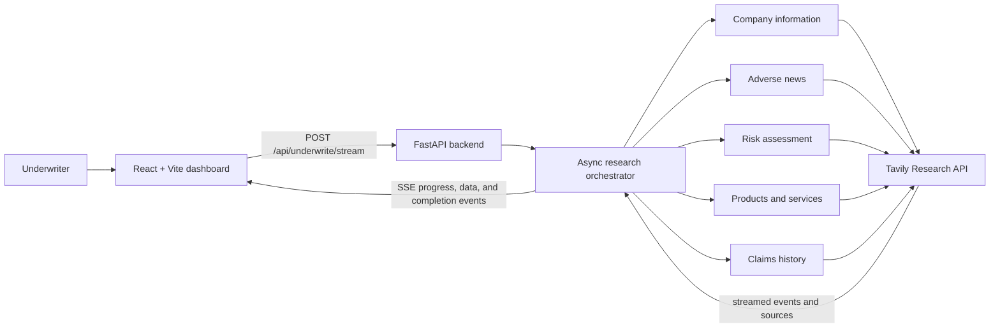
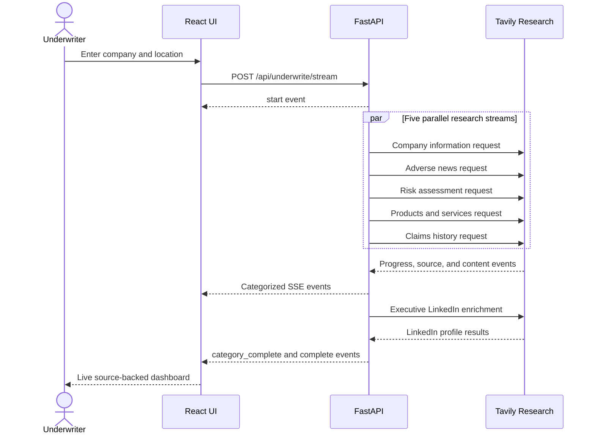

# Insurance Underwriter Agent

Insurance Underwriter Agent is an AI-powered underwriting research workspace built with [Tavily](https://tavily.com). Enter a company name and optional location to generate a source-backed company report in real time.

The application is designed for an underwriter's first-pass diligence workflow. It gathers public information across company profile, adverse news, risk, products and services, and claims history, then presents the results in a streamed dashboard with source links.

## How it works

```text
Browser (React + Vite)
        │  POST /api/underwrite/stream
        ▼
FastAPI backend
        │  starts five parallel research tasks
        ▼
Tavily Research API
        │  streams SSE events and sources
        ▼
Backend orchestrator
        │  tags, aggregates, and forwards events
        ▼
Live underwriting dashboard
```

1. The React frontend sends a company and optional location to the FastAPI backend.
2. The backend runs five research categories in parallel using Tavily's streaming Research API.
3. Progress updates, discovered sources, and completed category data are forwarded as Server-Sent Events (SSE).
4. When Company Information identifies executives, a supplemental LinkedIn lookup runs for matching profile URLs.
5. The dashboard updates as results arrive and keeps the supporting sources available for review.

This tool supports research and review; it does not make an automated underwriting decision.

## Problem statement

Commercial underwriters often need to assemble an initial company view from many public sources before they can assess exposure, request additional information, or decide which risks deserve deeper review. That process is repetitive, slow, and difficult to audit when research notes, sources, and conclusions are scattered across browser tabs and documents.

Insurance Underwriter Agent provides a single research workspace for that first-pass diligence. It turns a company name and optional location into a structured, source-linked report while keeping the human underwriter responsible for interpretation and the final decision.

## Architecture



## Research sequence



## APIs used

### Tavily Research API

The backend calls Tavily's Research endpoint at `https://api.tavily.com/research` with:

- `input`: the category-specific research question
- `model`: `mini`
- `output_schema`: structured fields for the category
- `stream`: `true`, so progress and results arrive incrementally

The Tavily API key is read from `TAVILY_API_KEY` in the root `.env` file. Never commit `.env`; it is excluded by `.gitignore`.

### Application API

`GET /` — backend health check.

`POST /api/underwrite/stream` — starts a streamed underwriting research session.

Request body:

```json
{
  "company_name": "Acme Corp",
  "location": "New York, NY"
}
```

The response uses Server-Sent Events. Events include `start`, `progress`, `sources_found`, `category_complete`, `error`, and `complete`.

## Local setup

### Prerequisites

- Python 3.10 or newer
- Node.js 18 or newer
- A Tavily API key

### Backend

From the repository root:

```bash
python -m venv venv
source venv/bin/activate
pip install -r requirements.txt
cp .env.sample .env
```

Add the key to `.env`:

```text
TAVILY_API_KEY=tvly-your-key-here
```

Start the API:

```bash
python -m backend.app
```

The backend runs on `http://localhost:8000`.

### Frontend

In a second terminal:

```bash
cd ui
npm install
npm run dev
```

Open `http://localhost:5173`.

For a production build:

```bash
npm run build
npm run preview
```

## Future additions

- Persistent research history and downloadable underwriting reports.
- User accounts, team workspaces, permissions, and audit trails.
- Configurable research templates by line of business and industry.
- Additional source connectors such as company filings, sanctions lists, court records, OSHA, and government data.
- Citation-level evidence mapping from each conclusion to source passages.
- Human review workflows with notes, approvals, and escalation queues.
- Confidence scoring, source freshness checks, and contradiction detection.
- Exposure-specific analysis for cyber, D&O, product liability, workers compensation, property, and commercial auto.
- Background jobs, retries, rate-limit handling, and observability for production workloads.
- Secure production deployment with managed secrets, authentication, and encrypted storage.

[](https://www.youtube.com/watch?v=Hhpvn4iYxGM)

## Getting Started

### 1. Clone and configure environment

```bash
cp .env.sample .env
```

Open `.env` and set your Tavily API key:

```
TAVILY_API_KEY=tvly-your-key-here
```

### 2. Start the backend

```bash
python -m venv venv
source venv/bin/activate   # Windows: venv\Scripts\activate
pip install -r requirements.txt
python -m backend.app
```

The API server starts at **http://localhost:8000**.

### 3. Start the frontend

In a separate terminal:

```bash
cd ui
npm install
npm run dev
```

The UI opens at **http://localhost:5173**.

## Usage

1. Open **http://localhost:5173** in your browser.
2. Enter a company name (and optional location).
3. Results stream in across five research categories:
   - **Company Information** — legal name, industry, NAICS code, employees, revenue, leadership
   - **Adverse News** — lawsuits, regulatory actions, negative press (last 5 years)
   - **Risk Assessment** — financial health, credit ratings, operational/compliance risks, ESG, overall rating
   - **Products & Services** — product lines, markets served, competitive position
   - **Claims History** — insurance claims, loss records, workplace safety, product liability

## Project Structure

```
├── .env.sample                  # Environment variable template
├── requirements.txt             # Python dependencies
├── backend/
│   ├── app.py                   # FastAPI entry point
│   ├── models.py                # Pydantic request/response models
│   ├── research_tasks.py        # Research category configurations
│   └── streaming/
│       ├── event_handler.py     # Processes Tavily stream events
│       ├── stream_orchestrator.py  # Parallel research orchestration
│       └── tavily_stream.py     # Tavily API streaming client
└── ui/
    ├── package.json
    ├── vite.config.ts
    ├── tailwind.config.js
    └── src/
        ├── main.tsx             # React entry point
        ├── App.tsx              # Main application component
        ├── types.ts             # TypeScript type definitions
        └── components/
            ├── Header.tsx
            ├── SearchForm.tsx
            ├── ProgressTracker.tsx
            ├── ResultsDashboard.tsx
            ├── CategoryCard.tsx
            ├── CompanyInfo.tsx
            ├── AdverseNews.tsx
            ├── RiskAssessment.tsx
            ├── ProductsServices.tsx
            ├── ClaimsHistory.tsx
            └── SourcesList.tsx
```

## Environment Variables

| Variable         | Required | Description                                                                 |
| ---------------- | -------- | --------------------------------------------------------------------------- |
| `TAVILY_API_KEY` | Yes      | Your Tavily API key. Can also be passed via the `Authorization` header.     |

## API

### `POST /api/underwrite/stream`

Streams underwriting research results as Server-Sent Events (SSE).

**Request body:**

```json
{
  "company_name": "Acme Corp",
  "location": "New York, NY"
}
```

**Response:** `text/event-stream` with real-time research updates per category.
